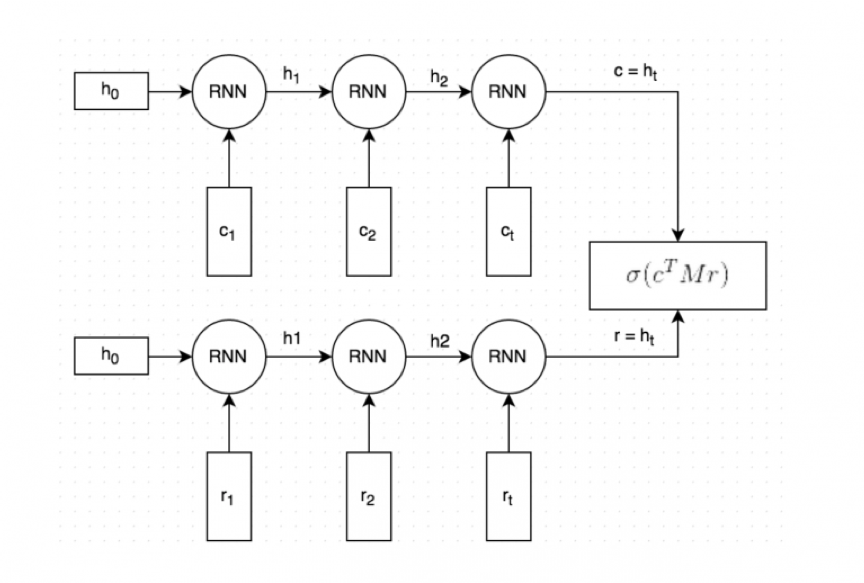

## Predicting responses in a dialogue: A dual encoder replication in keras

This is a keras implementation of the dual encoder architecture used in *The Ubuntu Dialogue Corpus: A Large Dataset for Research in Unstructured Multi-Turn Dialogue Systems*.

The paper details the construction of the Ubuntu Dialogue Corpus – an open source dataset of dialogues extracted from Ubuntu-related chat rooms. In the same paper they use the dataset to benchmark the task of predicting the next utterance or reply in a dialogue. For this task they linked two recurrent neural networks together as below using Global Vectors for Word Representation (GloVe) embedded text sequences as the input.

  
 

The data is available in a raw unformatted format with a script to stem and lemmatize and to include some special tokens e.g. \_\_eou\_\_ indicates the end of a user's turn in the dialogue. You can download the stemmed and lemmatized data [here](https://drive.google.com/file/d/0B_bZck-ksdkpVEtVc1R6Y01HMWM).

I apply further preprocessing by running `python ./utilities/prepare_data.py` to make the training more manageable on my machine. I limit the length of any text sequence to be 100 and apply tokenization such that a word must appear 6 times to be included in the vocabulary. 

## The Results

The test set contains the correct response to a given context as well as 9 false responses. The metric the paper uses is recall at *k*, which is the proportion of test examples that contain the true response in the top *k* predicted probabilities.

|      Metric        |    Paper    | Replication |
| ------------------ |:-----------:|:-----------:|
| 1 in 2 Recall @ 1  |    87.8%    |    87.3%    |
| 1 in 10 Recall @ 1 |    60.4%    |    55.1%    |
| 1 in 10 Recall @ 2 |    74.5%    |    73.2%    |
| 1 in 10 Recall @ 5 |    92.6%    |    93.5%    |

Considering the limitations I made during preprocessing, these results are quite similar.

## References

1. R. Lowe, N. Pow, I. Serban, and J. Pineau. The Ubuntu Dialogue Corpus: A Large Dataset for Research in Unstructured Multi-Turn Dialogue Systems. *Proceedings of the Meeting of the Special Interest Group on Dialogue and Discourse*, 2015.
1. R. Kadlec, M. Schmid, J. Kleindienst. Improved Deep Learning Baselines for Ubuntu Corpus Dialogs. *arXiv preprint arXiv:1510.03753*, 2015.
1. http://www.wildml.com/2016/07/deep-learning-for-chatbots-2-retrieval-based-model-tensorflow/
1. https://blog.keras.io/using-pre-trained-word-embeddings-in-a-keras-model.html
1. J. Pennington, R. Socher, and C.D. Manning. GloVe: Global Vectors for Word Representation. *Proceedings of the 2014 Conference on Empirical Methods in Natural Language Processing*, 2014.
